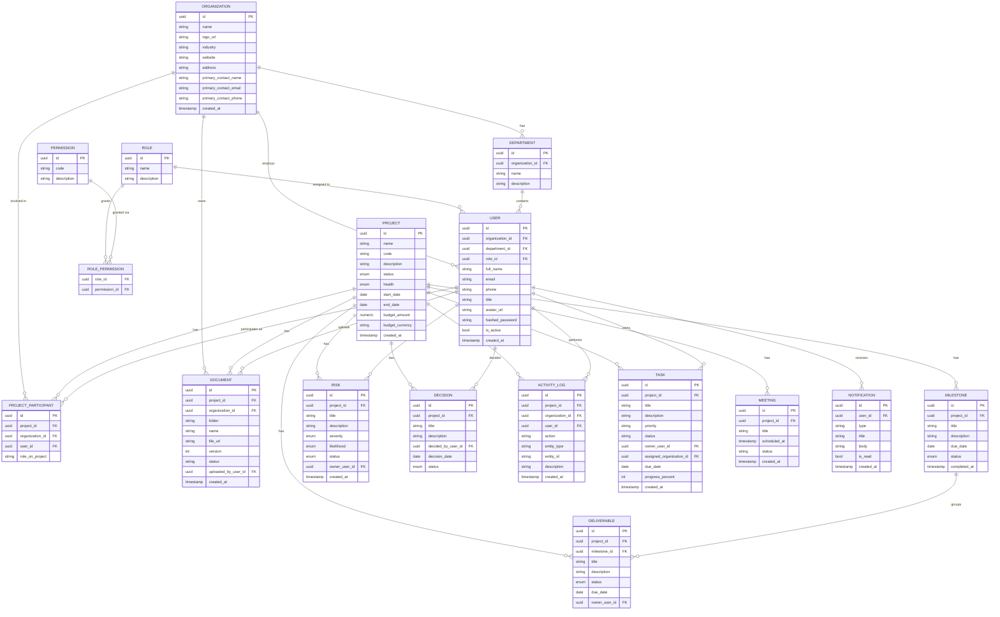

# Entity Relationship Diagram — Smart Ops Portal

Covers the full data model, including tables backing modules that are UI-stubbed in this pass (Documents, Tasks, Meetings, Notifications), so no migration rework is needed when those modules are built out.

## Notes
- All primary keys are UUIDs (`gen_random_uuid()`), suitable for multi-org, multi-project scale without ID collisions across future data imports.
- `ACTIVITY_LOG` is intentionally generic (`entity_type` + `entity_id`) so any future module can log into it without a schema change.
- `DOCUMENT`, `TASK`, `MEETING`, `NOTIFICATION` are present now as placeholder tables (referenced by the Dashboard summary endpoint for counts) but have no dedicated CRUD API yet — see `roadmap.md`.
